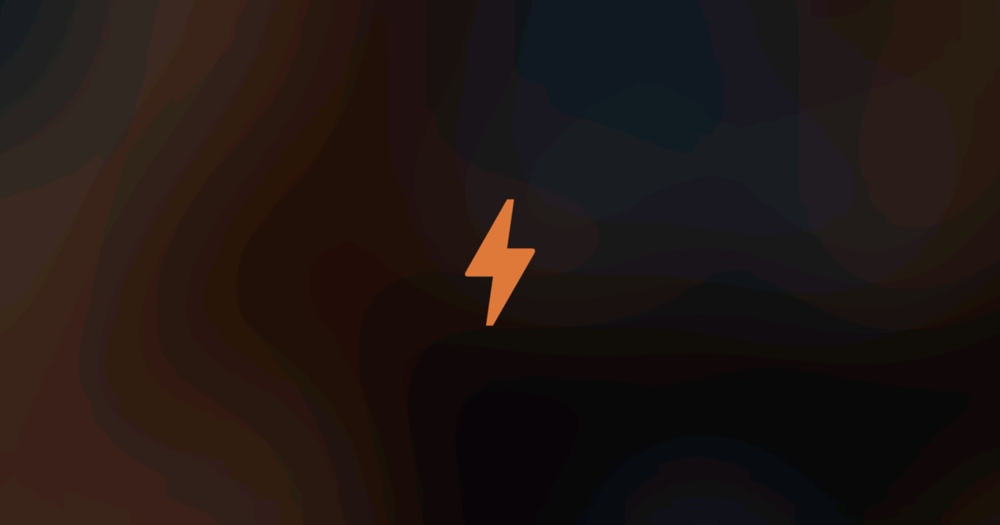
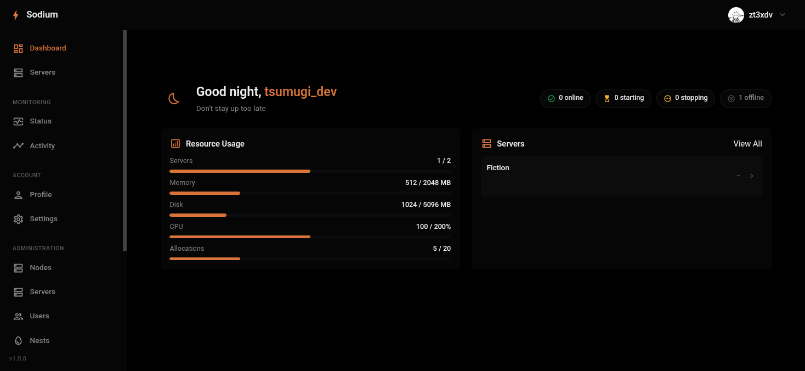
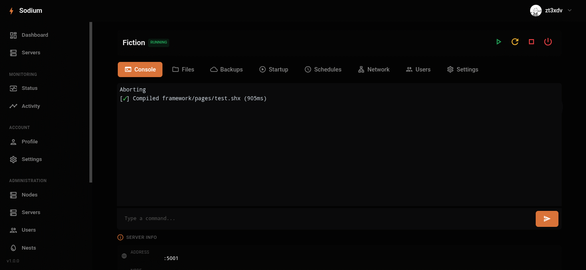
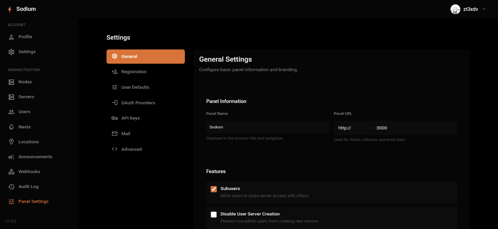

<p align="center">
  
</p>

<p align="center">
  <a href="LICENSE"></a>
  <a href="https://github.com/sodiumpanel/panel/releases"></a>
  <a href="https://github.com/sodiumpanel/panel/issues"></a>
  <a href="https://github.com/sodiumpanel/panel/stargazers"></a>
</p>

<p align="center">
  A modern, lightweight control panel for game server management.
</p>

---

## Screenshots

<p align="center">
  <br>
  <sub>Dashboard - Overview of your servers at a glance</sub>
</p>

<p align="center">
  <br>
  <sub>Server Management - Console, files, and resource monitoring</sub>
</p>

<p align="center">
  <br>
  <sub>Admin Panel - Full control over users, nodes, and servers</sub>
</p>

---

## Why Sodium?

| Feature | Sodium | Others |
|---------|--------|--------|
| **Lightweight** | Minimal resource usage | Heavy dependencies |
| **Easy Setup** | Single command install | Complex configuration |
| **Flexible Database** | File, SQLite, MySQL, PostgreSQL | Usually MySQL only |
| **Modern Stack** | Node.js | PHP, older tech |

## Quick Start

```bash
git clone https://github.com/sodiumpanel/panel.git
cd sodium
npm install
npm run build
npm start
```

## Documentation

See [docs/](docs/) for full documentation.

## Related

- [Sodium Reaction](https://github.com/sodiumpanel/reaction) - Node daemon for Sodium Panel

## Contributing

Contributions are welcome! Please read [CONTRIBUTING.md](CONTRIBUTING.md) before submitting PRs.

- Found a bug? [Open an issue](https://github.com/sodiumpanel/panel/issues)
- Have an idea? [Start a discussion](https://github.com/sodiumpanel/panel/discussions)

## License

[MIT](LICENSE)
